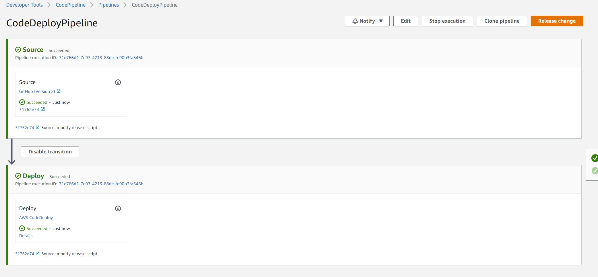

# AWS CodeDeploy と Codepipeline のデモ

## デモの内容

簡単なCI/CD環境を構築します。  
ソースコードがgithub（またはCodeCommit)にプッシュすると、CodeDeployで EC2インスタンスにリリースします。

## 利用するサビース

- EC2
- CodeDeploy
- CodePipeline
- CodeCommit (またはgithub)

## 環境構築＆各サビース設定

### githubでのレポジトリ作成

レポジトリを作成した上、下記のファイルを追加してgithubにプッシュします。
DemoRepo
    │-- appspec.yml
    │-- build
        │-- index.html
    └-- scripts
        │-- backup
        │-- install_dependencies
        │-- start_server
        └-- stop_server

|ファイル（フォルダ）|役割|
|--|--|
|appspec.yml|デプロイライフサイクルイベント設定|
|build|リリースファイルを保存するフォルダ|
|build/index.html|デモのhtmlファイル|
|scripts|デプロイで利用するスクリプト|
|scripts/backup|リリースする前に既存のファイルを圧縮する|
|scripts/install_dependencies|リリースする前に必須ライブラリのインスタンス|
|scripts/start_server|httpd起動スクリプト|
|scripts/stop_server|httpd停止スクリプト|

### EC2インスタンス作成

#### instance role 作成

IAM コンソール にて　「Roles」画面で下記の設定でRoleを作成して
- 「Select type of trusted entity」は  「AWS service」で、 「Choose a use case」は「EC2」を選択
- Permission は「AmazonEC2RoleforAWSCodeDeploy」を絞って選択
- Role名は　EC2InstanceRole

#### instance role 作成

下記の設定を確認した上、EC2 インスタンスを作成します。
- Step3 の IAM ROLE は　作成したEC2InstanceRoleを選択

- Step3 の User data は下記を追加

```
#!/bin/bash
yum -y update
yum update -y

yum install -y httpd
systemctl start httpd.service
systemctl enable httpd.service

yum install -y ruby
yum install -y aws-cli
cd /home/ec2-user
aws s3 cp s3://aws-codedeploy-ap-northeast-1/latest/install . --region ap-northeast-1
chmod +x ./install
./install auto
```

- Step5 の Tag は下記を追加


### CodeDeploy作成

#### CodeDeploy Service Role 作成

IAM コンソール にて　「Roles」画面で下記の設定でRoleを作成します
- 「Select type of trusted entity」は  「AWS service」で、 「Choose a use case」は「CodeDeploy」を選択
- Role名は　CodeDeployRole

#### CodeDeploy の Application 作成

CodeDeploy コンソールで Application作成
- Application名は MyDemoApplication
- Compute Platform は EC2/On-premisesを選択


#### CodeDeploy の DeploymentGroup 作成

Application作成した上、Application詳細設定画面で DeploymentGroup作成します。
- DeploymentGroup名は MyDemoDeploymentGroup
- Deployment typeは In-place　を選択
- Environment configurationで「Amazon EC2 Instances」を選択した上、「Key」のところ, EC2インスタンス作成する時、Tagsを設定したKey-valueを記入します。「1 unique matched instance」が表示されたらOKです。
- Deployment configurationは CodeDeployDefault.OneAtaTime を選択
- Load Balancerにて 「Load Balancer」を外す


### CodePipeline作成

CodePipeline コンソール　Pipelineを作成します。


### 確認

git にプッシュして、CodePipelineが実行できるか確認します。



